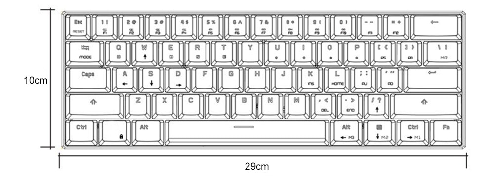

# 🔥 Hotkey to Motospeed CK62 ⌨️



<p align="center">
  

  
	
  <a href="https://www.linkedin.com/in/carlosgodri/">
    
  </a>

  <a href="https://github.com/godrix/motospeed-ck62-fix-key/commits/master">
    
  </a>

  <a href="https://github.com/godrix/motospeed-ck62-fix-key/issues">
    
  </a>
  
</p>

## ⌨️ install AutoKey

```shell
sudo apt install autokey-gtk
```

Download folder Motospeed-ck62 and put it in the `.config` > `autokey` > `data` in home directory

| Key           | Hotkey                | 
| ------------- |:---------------------:| 
| `Home`        |  `Alt`+`l`            | 
| `End`         |  `Alt`+`.`            | 
| `Insert`      |  `Alt`+`k`            | 
| `PageUp`      |  `Alt`+`;`            | 
| `PageDown`    |  `Alt`+`'`            | 
| `Delete`      |  `Alt`+`,`            | 
| `Pause Break` |  `Alt`+`]`            | 
| `Print Screen`|  `Alt`+`[`            | 
| ⬆️             |  `Alt`+`/`            |  
| ⬅️             |  🚫                   |  
| ➡️             |  `Alt`+`Right Ctrl`   |  
| ⬇️             |  `Alt`+`Menu`         |  
| F1            |  `Alt`+`1`            |  
| F2            |  `Alt`+`2`            |  
| F3            |  `Alt`+`3`            |  
| F4            |  `Alt`+`4`            |  
| F5            |  `Alt`+`5`            |  
| F6            |  `Alt`+`6`            |  
| F7            |  `Alt`+`7`            |  
| F8            |  `Alt`+`8`            |  
| F9            |  `Alt`+`9`            |  
| F10           |  `Alt`+`0`            |  
| F11           |  `Alt`+`-`            |  
| F12           |  `Alt`+`=`            | 
| `             |  `Ctrl`+`Esc`         |    
| ~             |  `Ctrl`+`Shift`+`Esc` |  


|  WASD         |  Hotkey       | 
| ------------- |:-------------:| 
| ⬆️             |  `Alt`+`w`    |  
| ⬅️             |  `Alt`+`a`    |  
| ➡️             |  `Alt`+`d`    |  
| ⬇️             |  `Alt`+`s`    |  

> For accented characters used in Portuguese for example use the ```composition key``` configuration available with Tweeks on ```keyboard and mouse``` and activate the option ```Compose Key```

```shell
sudo apt install gnome-tweaks
```
## 🤝 Contributing

Contributions, issues and feature requests are welcome!<br />Feel free to check [issues page](https://github.com/godrix/motospeed-ck62-fix-key/issues).
- Make a fork;
- Create a branck with your feature: `git checkout -b my-feature`;
- Commit changes: `git commit -m 'feat: My new feature'`;
- Make a push to your branch: `git push origin my-feature`.

After merging your receipt request to done, you can delete a branch from yours.

## Show your support

Give a ⭐️ if this project helped you!

## 📎 License

This project is under the MIT license. See the [LICENSE](LICENSE.md) for details.

---

Made with ♥ by Godrix :wave: [Get in touch!](https://www.linkedin.com/in/carlosgodri/)